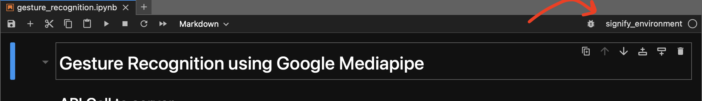

# Signify

Signify is *Alexa for the deaf and mute*. 

It is a machine learning app designed to offer AI assistance to individuals who use American Sign Language (ASL) for communication. It aims to enable seamless interactions with AI assistants through ASL, enhancing accessibility for the deaf community.

<div align="center">
    
</div>

## Tools used

- [Python](https://docs.python.org/3/)
- [MediaPipe](https://google.github.io/mediapipe/)
- [TensorFlow](https://www.tensorflow.org/overview)
- [Anaconda](https://docs.anaconda.com/)
- [Flask](https://flask.palletsprojects.com/)
- [Jupyter Notebook](https://jupyter-notebook.readthedocs.io/en/stable/)
- [OpenCV](https://docs.opencv.org/master/)

## Running the project locally

### Running the Computer Vision Notebook

Run the operations below using your terminal. The directory should be the root directory of the `Signify` project.

1. Download [Anaconda](https://www.anaconda.com/download).

2. Create a conda environment with Python 3.9 as mediapipe works perfectly for this version.

    ```bash
    conda create -n signify_environment python=3.9
    ```

3. Activate the conda environment

    ```bash
    conda activate signify_environment
    ```

4. Download the conda packages

    ```bash
    conda install -r conda_requirements.txt
    ```

5. Download the python packages using pip

    ```bash
    pip install -r pip_requirements.txt
    ```

6. Create a new kernel with `signify_environment`.

    ```bash
    conda install ipykernel 
    python -m ipykernel install --user --name=signify --display-name "signify_environment"
    ```

7. Run jupyter lab

    ```bash
    jupyterlab
    ```

8. Once you open the notebook make sure the top right corner where it shows the kernel says `signify_environment`.

    

9. Run all the cells using `shift` + `enter` until the open CV code starts running and you see the camera turn on.

10. Press `q` after selecting the camera window if you want to stop code execution and quit the camera.

### Running the backend

1. Navigate to the `api` directory in the `Signify` project directory.

2. Once you are in the `api` directory, create a python3 virtual environment to seperate the dependencies that you install for this project from the rest of your system.

    ```bash
    python3 -m venv venv
    ```

3. Activate the virtual environment.

    ```bash
    source venv/bin/activate
    ```

4. Install all python dependencies using pip.
    ```bash
    pip install -r requirements.txt
    ```

    If there are any errors in this step then install the packages manually by referencing the code.

5. Start the backend flask server.

    ```bash
    python run.py
    ```

### Running the frontend

1. Navigate to the `frontend` directory within the `Signify` project directory.

2. Install the packages using npm.

    ```bash
    npm i
    ```

3. Run the react app.

    ```bash
    npm start
    ```

## Resources

- [Gesture recognition guide for Python](https://developers.google.com/mediapipe/solutions/vision/gesture_recognizer/python)
- [Hand gesture recognition model customization guide](https://developers.google.com/mediapipe/solutions/customization/gesture_recognizer)
- [Udemy complete AI and ML Bootcamp by ZTM](https://www.udemy.com/share/102vAM3@uzvhf-FWASuZvecZ9RCJyF9n25CqgKAtCSlxnOch3PB_A_F7ZEdAXJ9b6V1QUXEo/)